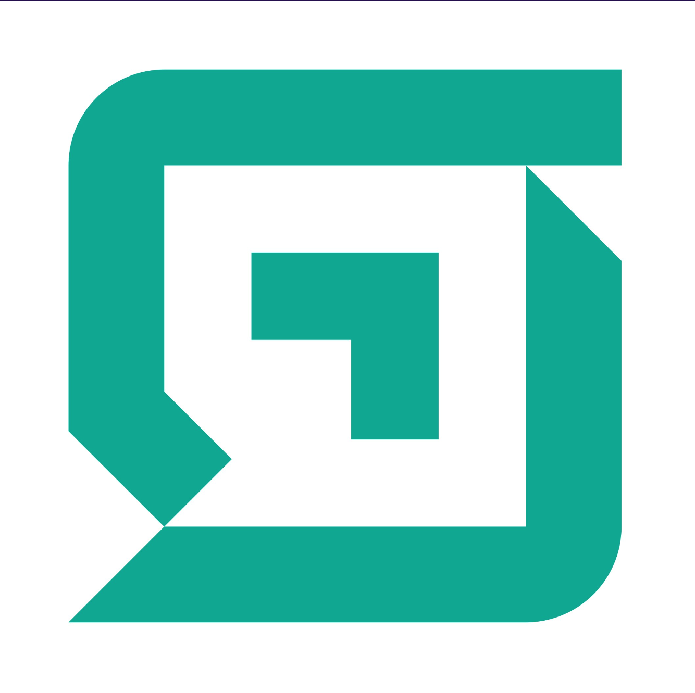
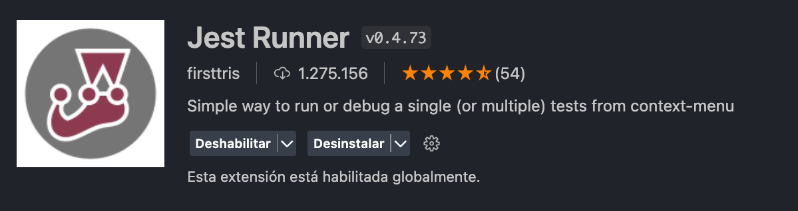
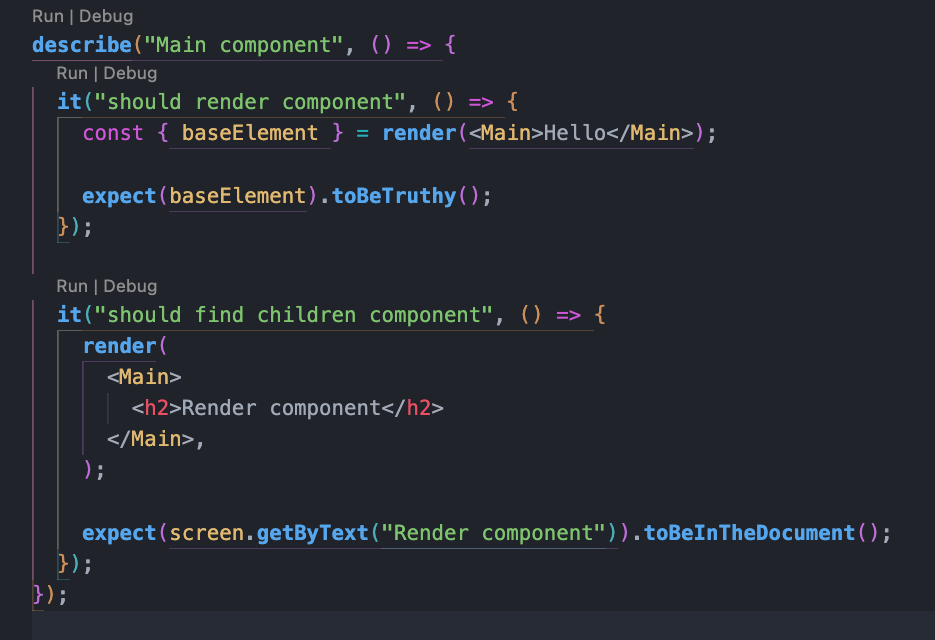

# Prueba técnica para SoftVault S.A



### Detalles del proyecto:

- Se replica el diseño que está en el [Figma](https://www.figma.com/design/tNFl8x5qGpCENxRJcAsIbB/Figma-Martin).
- Es agnóstico al manegador de paquetes que utilices. Por ejemplo: npm, pnpm, etc.
- Contiene test unitarios, documentación de los componentes con storybook, usa biome como linter y emotion para los estilos

## Pasos para levantar el proyecto:

- Para levantar el proyecto se utilzan los siguientes comandos:

```bash
npm run dev
# or
yarn run dev
# or
pnpm run dev
# or
bun dev
```

con esto el proyecto estará levantado en el puerto [localhost:3000](http://localhost:3000/)

- Para levantar storybook y ver la documentación de los componentes, se utilzan los siguientes comandos:

```bash
npm run storybook
# or
yarn run storybook
# or
pnpm run storybook
# or
bun storybook
```

con esto el proyecto estará levantado en el puerto [localhost:6006](http://localhost:6006/)

- Para correr los test unitarios no hay comandos. En este caso se necesita instalar la siguiente extensión para vscode:



Luego de instalarse la extensión, en los archivos `*.(spec|test).(js|jsx|ts|tsx)`; se verán de la siguiente forma:



y al tocar en algún botón que dice `Run`, se levantará una terminal ejecutando el test. Esto es bueno porque separa el testing de los demás archivos.
